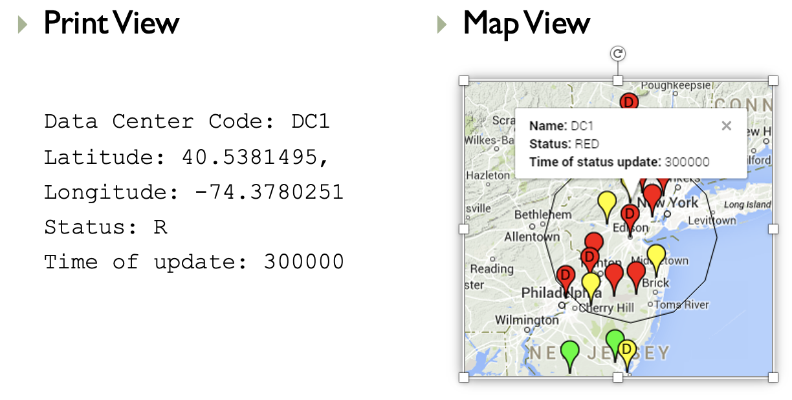

# Storm Finder Project

### Objectives
1. Detect storms approaching data centers
2. Classify critical statuses of data centers 
3. Take action to migrate traffic to less critical centers


### Process
1. Extract weather information from METAR file, a standardized weather reporting format. Example format:
    ```
    KTEB 300000Z 09037G53KT 5SM RA BR SCT025 OVC036 17/13 A2862
    KMMU 042345Z 35005KT 10SM OVC048 06/M01 A2999
    ```
2. Update status of weather stations based on weather information. Color codes: Green &rarr; safe, Yellow &rarr; warning, Red &rarr; storm occurring
3. Get nearby stations that would affect data centers.
4. Update status of data centers.


### Sample Output



### Modules in StormFinder
**`main`**
The following tasks are handled by `main`:
1. Extraction and parsing of METAR data from the provided file
2. Creation and update of `Station` objects
3. Creation and update of `DataCenter` objects

**`observers`**
The visual representation

**`datacenter`**
`Station` and `DataCenter` classes and functions

**`settings`**
This is where the user would modify setting including metar and datacenter file paths (required input). In the settings, `wind` and `gust` thresholds also need to be set (default values provided). Finally, the radius of impact should also be specified; i.e. define the size of the area around the data center that should be considered.

**`gmaps`**
An customized implementation of the `pygmaps` package


